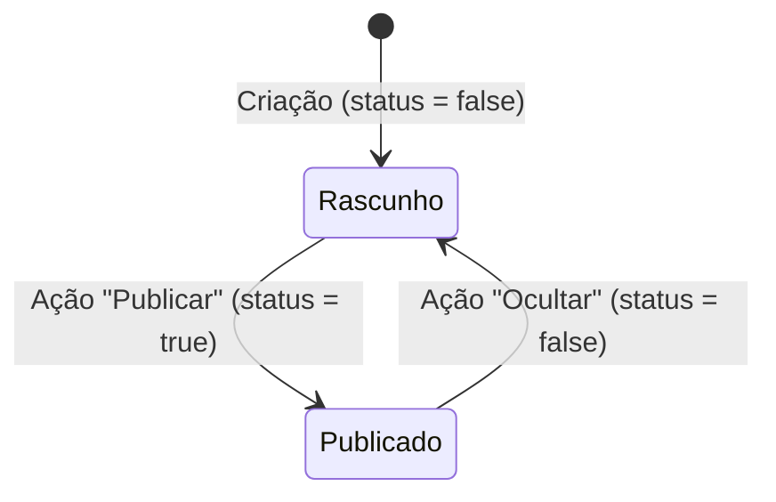
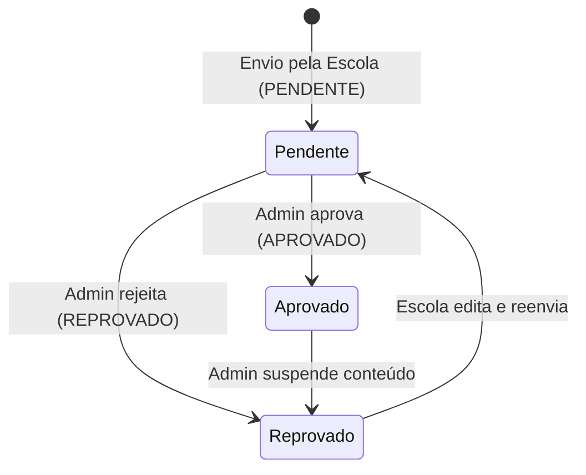

# Data Model: Ecotech Platform

Este documento detalha o modelo de dados e as regras de integridade do projeto Ecotech.

## 1. Entidades do Prisma e Relacionamentos

### User (Usuário)
* **Descrição**: Gerencia as identidades dos usuários (Admin, Escola, Professor, Estudante).
* **Campos**:
  * `id`: String (UUID, PK)
  * `name`: String (Nome completo, obrigatório)
  * `email`: String (Único, formato de e-mail válido)
  * `phone`: String (Opcional)
  * `password`: String (Criptografada por bcrypt/argon2)
  * `role`: Enum `Role` (ADMIN, SCHOOL_MANAGER, TEACHER, STUDENT)
  * `schoolId`: String (FK para School, opcional)
  * `profileImage`: String (URL no storage, opcional)
  * `status`: Boolean (Ativo/Inativo, padrão `true`)
* **Relacionamentos**:
  * Pertence opcionalmente a uma `School` (Escolas possuem vários usuários).
  * Cria múltiplos `FeedPosts`, `Stories`, `LibraryContents`, `FeedLikes`, `FeedComments` e `TrailLikes`.
  * Pode seguir escolas (tabela `SchoolFollower`).

### School (Instituição de Ensino)
* **Descrição**: Escolas cadastradas que possuem trilhas e interagem com a comunidade.
* **Campos**:
  * `id`: String (UUID, PK)
  * `name`: String (Nome da escola, obrigatório)
  * `city`: String (Município)
  * `location`: String (Endereço físico/coordenadas)
  * `territory`: String (Território ou comunidade pertencente)
  * `responsibleName`: String (Nome do responsável)
  * `email`: String (Contato comercial da escola)
  * `phone`: String (Contato telefônico)
  * `description`: String (Histórico/Descrição)
  * `coverImage`: String (URL da imagem de capa, opcional)
  * `status`: Boolean (Ativo/Inativo, padrão `true`)
* **Relacionamentos**:
  * Possui vários `Users` (professores/estudantes).
  * Possui vários seguidores (`SchoolFollower`).
  * Cria/Gerencia várias `Trails` (Trilhas).

### Trail (Trilha Ecológica)
* **Descrição**: Rotas ecológicas mapeadas e vinculadas às escolas.
* **Campos**:
  * `id`: String (UUID, PK)
  * `schoolId`: String (FK para School, obrigatório)
  * `title`: String (Nome da trilha)
  * `slug`: String (Único, usado para rotas limpas do Next.js)
  * `shortDescription`: String (Resumo rápido para os cards)
  * `fullDescription`: String (Descrição detalhada)
  * `city`: String (Município)
  * `coverImage`: String (URL da foto principal)
  * `biome`: String (Ex: Mata Atlântica)
  * `distanceKm`: Float (Extensão da trilha em Km)
  * `duration`: String (Tempo estimado de percurso)
  * `difficulty`: Enum `Difficulty` (FACIL, MODERADA, DIFICIL)
  * `wikilocUrl`: String (URL externa do Wikiloc, opcional)
  * `safetyWarnings`: String (Instruções e avisos de segurança)
  * `status`: Boolean (Publicada/Rascunho, padrão `false`)
* **Relacionamentos**:
  * Pertence a uma `School`.
  * Possui muitas fotos (`TrailPhoto`), curtidas (`TrailLike`) e favoritados (`SavedTrail`).
  * Possui muitos `EducationalPoints` (pontos educativos) ordenados.
  * Possui muitos `BiodiversityItems` (fauna e flora vinculadas).

### EducationalPoint (Ponto Educativo)
* **Descrição**: Paradas pedagógicas distribuídas ao longo das trilhas.
* **Campos**:
  * `id`: String (UUID, PK)
  * `trailId`: String (FK para Trail, obrigatório)
  * `title`: String (Nome do ponto)
  * `slug`: String (Único para URL pública)
  * `type`: Enum `PointType` (ARVORE, PLANTA, RIO, MANGUEZAL, FAUNA, ESPACO_CULTURAL, AREA_VERDE, OUTRO)
  * `order`: Int (Posição ordenada na trilha)
  * `shortDescription`: String (Descrição rápida)
  * `fullDescription`: String (Descrição completa)
  * `curiosities`: String (Curiosidades)
  * `environmentalImportance`: String (Importância ecológica)
  * `preservationCare`: String (Instruções de cuidado)
  * `mainImage`: String (URL da foto do ponto)
  * `offlineSummary`: String (Resumo textual curto de no máximo 250 caracteres)
  * `status`: Boolean (Publicado/Rascunho, padrão `false`)
* **Relacionamentos**:
  * Pertence a uma `Trail`.
  * Possui um ou mais `QrCodes` gerados.

### BiodiversityItem (Biodiversidade da Trilha)
* **Descrição**: Elementos biológicos associados diretamente a uma trilha (separados em Fauna e Flora).
* **Campos**:
  * `id`: String (UUID, PK)
  * `trailId`: String (FK para Trail, obrigatório)
  * `groupType`: String (Restrito aos valores "fauna" ou "flora")
  * `popularName`: String (Nome popular)
  * `scientificName`: String (Nome científico, opcional)
  * `description`: String (Descrição do espécime)
  * `image`: String (URL da imagem)
  * `curiosities`: String (Opcional)
  * `environmentalImportance`: String (Papel no ecossistema)
* **Relacionamentos**:
  * Pertence a uma `Trail`.

### Outras Entidades Sociais e Auxiliares
* **Story**: Mídias rápidas com `expiresAt` igual a 24 horas da data de criação.
* **FeedPost / FeedLike / FeedComment**: Estrutura social de interações do Feed.
* **LibraryContent**: Documentos e vídeos da biblioteca educativa contendo `approvalStatus` (PENDENTE, APROVADO, REPROVADO).
* **Partner / PartnerPhoto**: Registro da Rede de parceiros locais de apoio turístico/comunitário.

---

## 2. Regras de Validação de Dados

1. **E-mail de Usuário**: Deve seguir regex de e-mail e ser único no sistema.
2. **Offline Summary (EducationalPoint)**: O campo `offlineSummary` MUST ser validado no backend NestJS com DTO (ex: `@MaxLength(250)`) para impedir QR Codes de alta densidade ilegíveis física e offline.
3. **Mídias**: O arquivo de postagem deve ser validado para aceitar apenas formatos de imagem comuns (JPEG, PNG, WEBP) e vídeo (MP4) de até 50MB.
4. **Links Externos**: URLs inseridas em `wikilocUrl` e parceiros locais devem passar por validação de URL do class-validator para evitar injeções de scripts maliciosos.

---

## 3. Transições de Estados (Máquinas de Estado)

### Estado de Publicação de Trilhas e Pontos (`status` Boolean)

* **Regra**: Um `EducationalPoint` só pode ser visualizado na rota pública do Next.js se o seu respectivo `status` estiver marcado como `true` AND a `Trail` correspondente também estiver marcada como `status = true`.

### Estado de Aprovação de Conteúdos da Biblioteca (`ApprovalStatus`)

* **Regra**: Somente registros com `approvalStatus = APROVADO` aparecem nas rotas públicas e listagens da Biblioteca. Registros de Escolas não-aprovados ficam restritos à visualização do autor no painel da própria Escola e do Admin na tela de moderação.
